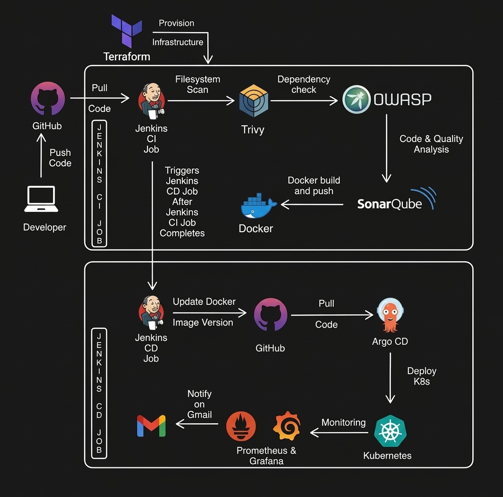
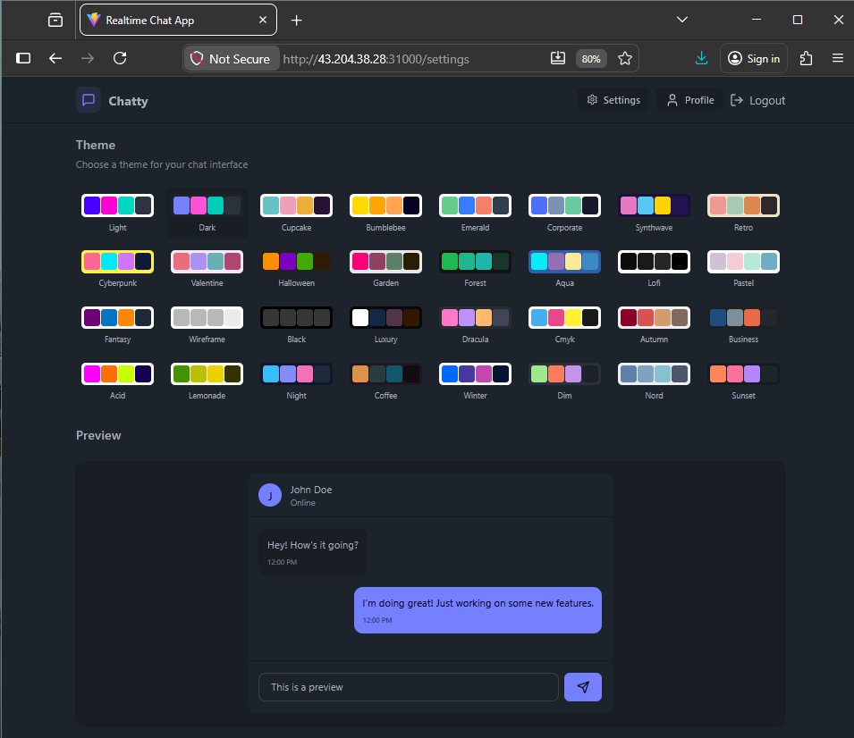
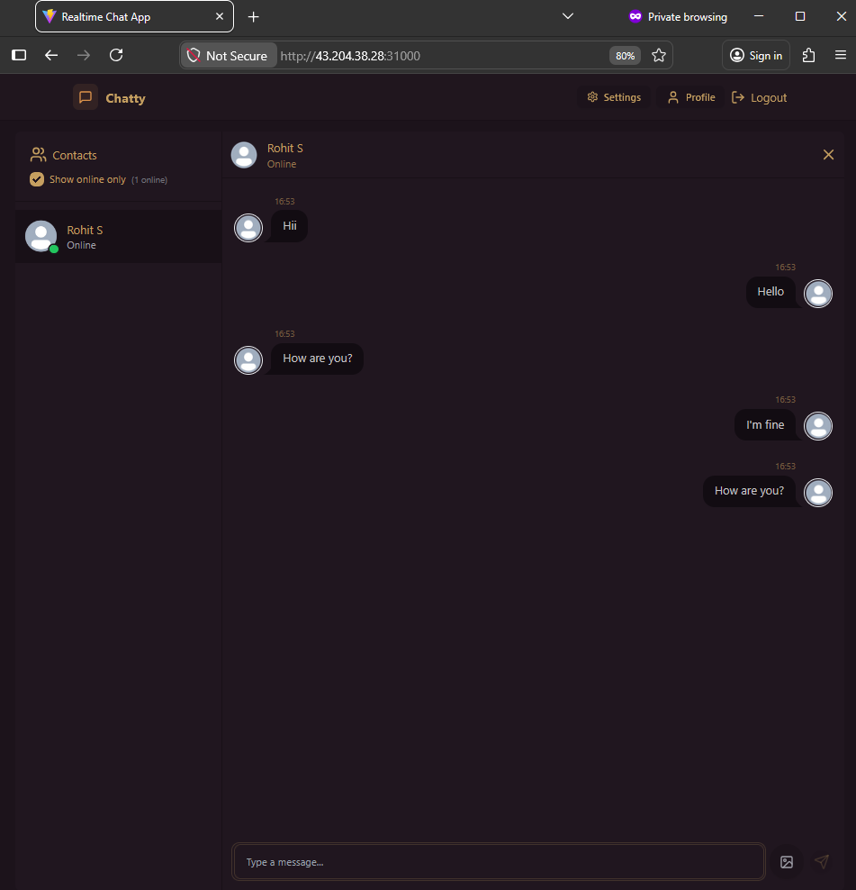
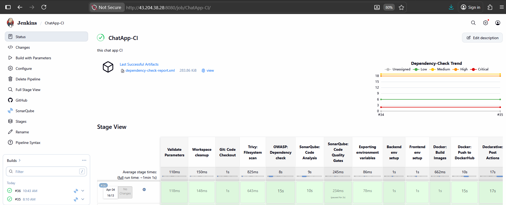
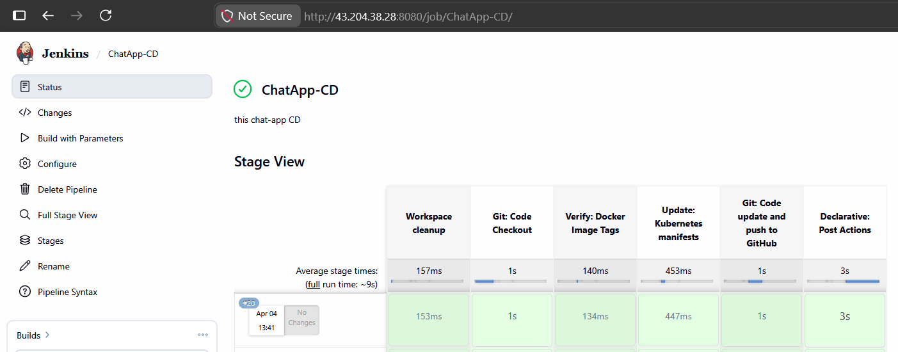
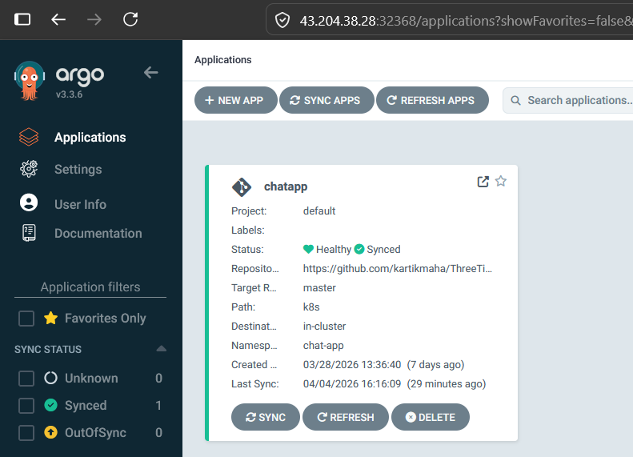
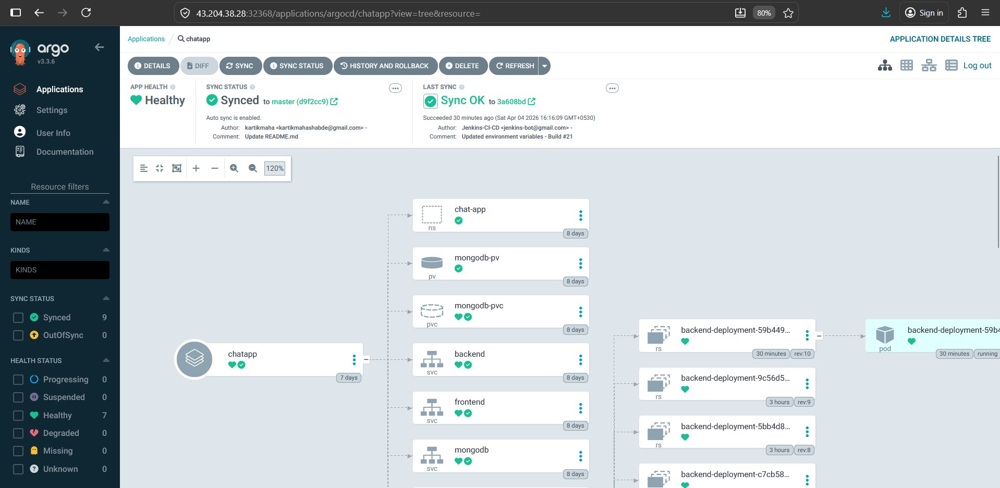
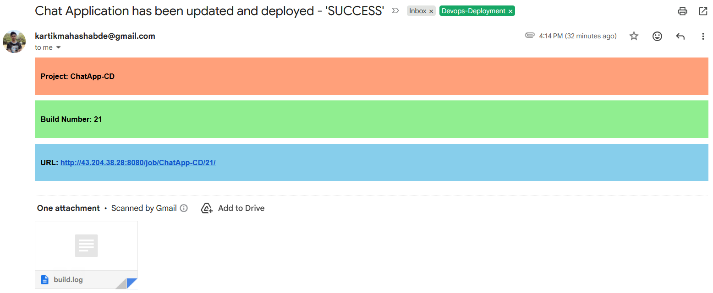
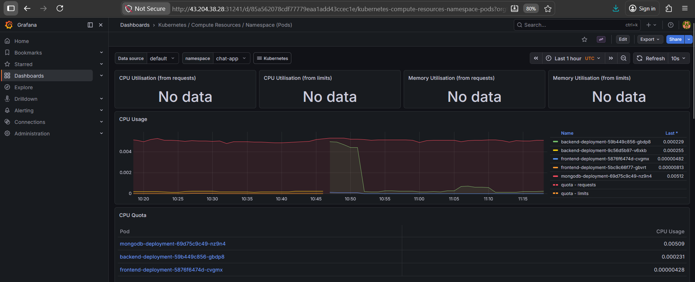

# 🚀 Three-Tier Chat Application

A production-ready CI/CD implementation of a three-tier web application.  
Demonstrates full-stack automation from infrastructure provisioning to container orchestration and continuous delivery.

---

## Detailed Project Workflow :

---

## 🏗️ Architecture Overview

The application follows a standard **Three-Tier Architecture**:

- **Frontend (React)** → Delivers responsive UI and interacts with backend via REST APIs and WebSockets for real-time updates  
- **Backend (Node.js)** → Handles business logic, authentication, and enables real-time messaging with bi-directional communication  
- **Database (MongoDB)** → Persists user data and chat messages with efficient CRUD operations  

---

## 🛠️ Technical Stack

- **Cloud**: AWS  
- **Containerization**: Docker & Docker Hub  
- **Orchestration**: Kubernetes  
- **CI/CD Pipeline**: Jenkins & ArgoCD (GitOps)  
- **Infrastructure as Code**: Terraform  

### 🔐 DevSecOps
- **SonarQube** (SAST - Static Application Security Testing)  
- **OWASP Dependency-Check** (SCA - Software Composition Analysis)  
- **Trivy** (Filesystem Vulnerability Scan)  

### 📊 Monitoring
- **Prometheus & Grafana**

---

## 🚀 Key Features

- 🔁 **End-to-End Automation** → Jenkins-controlled CI/CD pipeline  
- 🏗️ **Infrastructure as Code** → Modular Terraform for reproducible environments  
- 🔄 **GitOps Workflow** → ArgoCD ensures declarative Kubernetes deployments  
- 🔐 **Security Integration** → SAST & vulnerability scanning in CI pipeline  
- 📈 **Scalability** → Kubernetes-based horizontal scaling  

---

## 📈 CI/CD Pipeline Workflow

### 🔹 1. Code Commit & Trigger
- Developer pushes code to **GitHub**  
- **Jenkins CI pipeline** is automatically triggered  

### 🔹 2. CI Stage – Quality & Security Checks
- **Trivy** → Filesystem vulnerability scan  
- **OWASP Dependency Check** → Detects vulnerable libraries  
- **SonarQube** → Code quality & static analysis  

### 🔹 3. Build & Package
- Jenkins builds a **Docker image**  
- Image is pushed to **Docker Hub**  

### 🔹 4. CD Trigger
- Jenkins triggers **CD pipeline** after successful CI  
- Updates Docker image version in **GitHub manifests**  

### 🔹 5. GitOps Deployment (ArgoCD)
- **ArgoCD** detects repo changes  
- Syncs and deploys to **Kubernetes cluster**  

### 🔹 6. Application Deployment
- Kubernetes pulls latest image and deploys application  
- Ensures **scalable & self-healing workloads**  

### 🔹 7. Monitoring & Alerts
- **Prometheus + Grafana** monitor system health  
- Alerts sent via **Gmail notifications**  

---

## 📚 Project Snapshots:

---

## 📜 License

This project is licensed under the MIT License. See the LICENSE file for more details.

---
