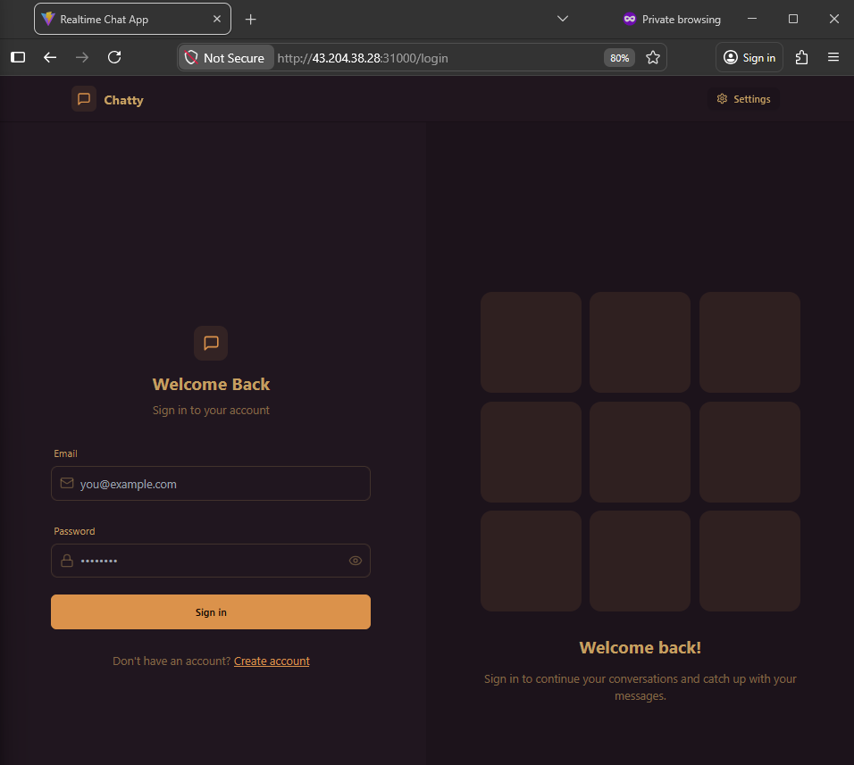

# 🚀 Three-Tier Chat Application

A production-ready CI/CD implementation of a three-tier web application.  
Demonstrates full-stack automation from infrastructure provisioning to container orchestration and continuous delivery.

---

### 🔄 Detailed Project Workflow:

---

## 📚 Project Snapshots

### 🎨 Application UI

- 🔐 **Login Page**

  

- 💬 **Chat Interface**  

  

- ⚙️ **Settings Page**  

  

- 🚪 **Logout Flow**  

  

---

### 🔄 CI/CD Pipeline

- 🏗️ **Jenkins CI Pipeline**  

  

- 🚀 **Jenkins CD Pipeline**  

  

---

### ⚙️ GitOps Deployment

- 🔄 **ArgoCD Dashboard**  

  

- 📦 **ArgoCD Application Sync**  

  

---

### 📊 Monitoring & Alerts

- 📈 **Monitoring Dashboard (Prometheus + Grafana)**  

  

- 📧 **Deployment Email Notification**  

  

---

## 🏗️ Architecture Overview

The application follows a **Three-Tier Architecture**:

- 🎨 **Frontend (React)**  
  → Responsive UI with seamless communication via **REST APIs & WebSockets** for real-time updates  

- ⚙️ **Backend (Node.js / Express)**  
  → Handles **business logic, authentication**, and enables **real-time messaging** with bi-directional communication  

- 🗄️ **Database (MongoDB)**  
  → Efficiently stores **user data & chat messages** with optimized CRUD operations  

---

## 🛠️ Technical Stack

- ☁️ **Cloud** → AWS  
- 📦 **Containerization** → Docker & Docker Hub  
- ☸️ **Orchestration** → Kubernetes  
- 🔄 **CI/CD Pipeline** → Jenkins + ArgoCD (GitOps)  
- 🏗️ **Infrastructure as Code** → Terraform  

---

## 🔐 DevSecOps

- 🔍 **SonarQube** → Static Code Analysis (SAST)  
- 🛡️ **OWASP Dependency-Check** → Vulnerability detection (SCA)  
- 🐳 **Trivy** → Filesystem & image security scanning  

---

## 📊 Monitoring

- 📈 **Prometheus** → Metrics collection & alerting  
- 📉 **Grafana** → Visualization & real-time dashboards  

---

## 🚀 Key Features

- 🔁 **End-to-End Automation** → Jenkins-controlled CI/CD pipeline  
- 🏗️ **Infrastructure as Code** → Modular Terraform for reproducible environments  
- 🔄 **GitOps Workflow** → ArgoCD ensures declarative Kubernetes deployments  
- 🔐 **Security Integration** → SAST & vulnerability scanning in CI pipeline  
- 📈 **Scalability** → Kubernetes-based horizontal scaling  

---

## 📈 CI/CD Pipeline Workflow

### 🔹 1. Code Commit & Trigger
- 🚀 Developer pushes code to **GitHub**  
- 🔄 **Jenkins CI pipeline** automatically triggers and initiates the workflow  

---

### 🔹 2. CI Stage – Quality & Security Checks
- 🐳 **Trivy** → Performs filesystem vulnerability scanning  
- 🛡️ **OWASP Dependency Check** → Identifies vulnerable third-party libraries  
- 🔍 **SonarQube** → Ensures code quality and runs static analysis  

---

### 🔹 3. Build & Package
- 🏗️ Jenkins builds a **Docker image**  
- 📦 Image is pushed to **Docker Hub registry**  

---

### 🔹 4. CD Trigger
- ⚡ Jenkins triggers **CD pipeline** after successful CI execution  
- 📝 Updates Docker image version in **Kubernetes manifests (GitHub)**  

---

### 🔹 5. GitOps Deployment (ArgoCD)
- 🔄 **ArgoCD** continuously monitors GitHub for changes  
- 🚀 Automatically syncs and deploys to **Kubernetes cluster**  

---

### 🔹 6. Application Deployment
- ☸️ Kubernetes pulls latest image and deploys application  
- 📈 Ensures **scalability, high availability, and self-healing**  

---

### 🔹 7. Monitoring & Alerts
- 📊 **Prometheus** → Collects metrics and system health data  
- 📉 **Grafana** → Visualizes real-time dashboards  
- 📧 Sends **alert notifications via Gmail**  

---

## 📜 License

This project is licensed under the MIT License. See the LICENSE file for more details.

---
